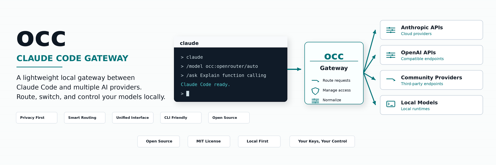
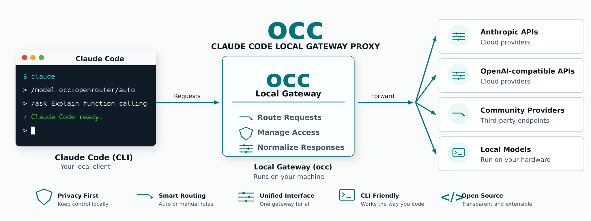

# claude-occ

<p align="center">
  English · <a href="README.ko.md">한국어</a> · <a href="README.zh-CN.md">简体中文</a> · <a href="README.es.md">Español</a> · <a href="README.ja.md">日本語</a>
</p>

<p align="center">
  <b>Claude Code, routed through your own provider gateway.</b>
</p>

<p align="center">
  <code>occ init</code> · <code>claude</code> · <code>occ native</code> · <b>localhost:10110</b>
</p>

<p align="center">
  
</p>

<p align="center">
  <a href="https://www.npmjs.com/package/claude-occ"></a>
  <a href="https://github.com/flyingsquirrel0419/claude-occ/releases/latest"></a>
  
  
</p>

claude-occ is a local Claude Code gateway proxy. It makes Claude Code talk to a local `occ` daemon
through the Anthropic Messages API, while `occ` routes requests to Anthropic-compatible,
OpenAI-compatible, Google, Azure, local, or custom providers.

It is intentionally separate from [opencodex](https://github.com/lidge-jun/opencodex). opencodex
targets Codex and the OpenAI Responses API; claude-occ targets Claude Code and the
`ANTHROPIC_BASE_URL` / `ANTHROPIC_API_KEY` integration surface.

> Claude Code subscription OAuth stays native-only. claude-occ does not extract or reuse Claude Code
> subscription tokens as upstream credentials. Use `occ native` when you want Claude Code's built-in
> subscription mode.

## Why

Claude Code already speaks the Anthropic Messages API. claude-occ places a small authenticated proxy
between Claude Code and your chosen upstream so you can:

- use provider API keys or environment-variable references such as `${UMANS_API_KEY}`;
- expose routed models in Claude Code's `/model` picker;
- run OpenAI-compatible local servers through Claude Code;
- switch back to native Claude Code with one command;
- keep the proxy on loopback and authenticate Claude Code with a generated local gateway token.

<p align="center">
  
</p>

## Quick Start

Prerequisites:

- Claude Code installed and available as `claude`.
- Node.js 18+ for npm installation, or Rust stable for source builds.

Install from npm after the package is published:

```bash
npm install -g claude-occ
```

Install from a source checkout today:

```bash
cargo build --release
npm install -g ./npm
```

Set up a provider:

```bash
occ init
```

`occ init` is interactive. It writes `~/.claude-occ/config.json`, stops any stale proxy first, asks
for a provider, stores API keys as direct values or environment-variable references, lets you choose a
model, and offers the Claude autostart shim. The shim is the default path: when you run `claude`, it
runs `occ ensure`, injects the local gateway environment, and then launches the real Claude Code
binary.

Use Claude Code normally:

```bash
claude
```

Or run without the shim:

```bash
occ ensure
eval "$(occ env)"
claude
```

Return to native Claude Code:

```bash
occ native
```

`occ native` stops the claude-occ proxy, removes the `claude` shim, and restores native Claude Code
behavior. Re-enable routing later with:

```bash
occ restore back
```

## Common Commands

```bash
occ init                         # interactive setup
occ start [--port 10110]         # start the local gateway
occ ensure                       # start if needed; replaces stale-token gateways
occ stop                         # stop the gateway
occ restart                      # stop and start the gateway
occ status [--json]              # show config path, shim state, and proxy health
occ health [--json]              # authenticated health check through /v1/models
occ env                          # print shell exports for manual Claude Code routing
occ enable                       # install the Claude autostart shim
occ native                       # stop proxy and restore native Claude Code
occ restore back                 # re-enable the shim after native mode
occ uninstall                    # remove shim/runtime/config

occ provider list [--json]
occ provider add umans --set-default
occ provider add openrouter --api-key '${OPENROUTER_API_KEY}' --set-default
occ provider add local \
  --adapter openai-chat \
  --base-url http://127.0.0.1:11434/v1 \
  --default-model llama3 \
  --model llama3 \
  --set-default
occ models [--json]
occ models --provider umans
```

`occ codex-shim ...` is kept as an opencodex-compatible alias, but for this project it manages the
Claude Code launcher shim. `occ claude-shim ...` is available as an alias.

## Providers

`occ init` includes a registry-style provider picker inspired by opencodex. Current provider entries
include:

| Provider family | Adapter | Auth style |
|---|---|---|
| Umans AI Coding Plan | `anthropic` | API key or env var |
| Anthropic API | `anthropic` | API key or env var |
| OpenRouter | `openai-chat` | API key or env var |
| OpenAI API | `openai-chat` | API key or env var |
| Google Gemini API | `google` | API key or env var |
| Azure OpenAI | `azure-openai` | API key |
| DeepSeek, Groq, Together, Fireworks, Cerebras, Mistral, Hugging Face, NVIDIA NIM, MiniMax, Qwen Portal, Ollama Cloud, and more | `openai-chat` | API key or env var |
| Ollama, vLLM, LM Studio | `openai-chat` | local, usually blank key |
| Custom OpenAI-compatible endpoint | `openai-chat` | optional key |

OAuth/forward-login entries from opencodex are present only as compatibility stubs where Claude Code
cannot safely reuse those credentials. `occ login <provider>` explains that boundary instead of
extracting tokens.

## Model Discovery

The gateway exposes:

```http
GET /v1/models
```

Claude Code sees configured models as `provider/model`, for example:

```text
umans/umans-coder
umans/umans-kimi-k2.7
umans/umans-glm-5.2
openrouter/anthropic/claude-sonnet-5
local/llama3
```

The launcher shim also overrides Claude Code's native model slots with proxy model ids so `/model`
can show routed models instead of only native Claude families.

## Configuration

Config lives at:

```text
~/.claude-occ/config.json
```

Example:

```json
{
  "host": "127.0.0.1",
  "port": 10110,
  "gateway_token": "occ_generated_local_token",
  "default_provider": "umans",
  "providers": {
    "umans": {
      "adapter": "anthropic",
      "base_url": "https://api.code.umans.ai",
      "api_key": "${UMANS_API_KEY}",
      "default_model": "umans-coder",
      "models": [
        "umans-coder",
        "umans-kimi-k2.7",
        "umans-glm-5.2"
      ]
    }
  }
}
```

API keys may be literal strings, `$ENV_VAR`, or `${ENV_VAR}` references. The generated
`gateway_token` is used only between Claude Code and the local claude-occ gateway.

## Gateway API

claude-occ implements the Claude Code-facing parts of the Anthropic Messages API:

| Endpoint | Purpose | Auth |
|---|---|---|
| `GET /healthz` | unauthenticated process health | none |
| `GET /v1/models` | model discovery | `x-api-key` or `Authorization: Bearer` |
| `POST /v1/messages` | non-streaming and streaming messages | `x-api-key` or `Authorization: Bearer` |
| `POST /v1/messages/count_tokens` | local token estimate | `x-api-key` or `Authorization: Bearer` |
| `GET /api/config` | management summary | `x-api-key` or `Authorization: Bearer` |
| `GET /api/providers` | configured providers | `x-api-key` or `Authorization: Bearer` |
| `POST /api/stop` | graceful local stop | `x-api-key` or `Authorization: Bearer` |

By default the gateway binds to `127.0.0.1`. Treat non-loopback binding as experimental and protect
the config file and gateway token like credentials.

## Build From Source

```bash
cd claude-occ
cargo test
cargo build --release
./target/release/occ --help
```

For npm package smoke checks:

```bash
cd npm
node ./bin/postinstall.js
node ./bin/occ.js --version
npm pack --dry-run
```

## Verification

```bash
cargo test
cargo clippy --all-targets -- -D warnings
./scripts/command-surface.sh
./scripts/smoke.sh
cargo build --release
```

`scripts/smoke.sh` starts a fake OpenAI-compatible upstream, sends Claude Messages requests through
claude-occ, and verifies non-streaming and streaming responses.

## Project Layout

```text
src/main.rs          CLI, init flow, provider registry, process lifecycle
src/config.rs        config format, model slot mapping, Umans metadata
src/integration.rs   Claude launcher shim install/uninstall
src/server.rs        local Axum gateway endpoints
src/providers.rs     provider routing and protocol translation
src/models.rs        Anthropic Messages request/response structures
npm/                 npm wrapper and release-binary installer
scripts/             command-surface and gateway smoke tests
```

## Compatibility Notes

- opencodex targets Codex and `/v1/responses`; claude-occ targets Claude Code and `/v1/messages`.
- `occ service` exists for command compatibility, but the current implementation uses lightweight
  `occ ensure` / launcher-shim behavior rather than an OS service manager.
- `occ gui` currently prints the local dashboard URL; a web dashboard is not yet implemented.
- `occ sync-cache` is a compatibility no-op because Claude Code has no writable model cache like
  Codex.

## Security

See [SECURITY.md](SECURITY.md). In short:

- do not commit `~/.claude-occ/config.json`;
- claude-occ writes config and runtime files with owner-only permissions on Unix;
- prefer environment-variable references for provider keys;
- keep the gateway on loopback unless you have reviewed the exposure;
- use `occ native` for Claude Code subscription OAuth.

## Contributing

See [CONTRIBUTING.md](CONTRIBUTING.md) for development setup, test commands, and provider/adapter
guidelines.

## Changelog

See [CHANGELOG.md](CHANGELOG.md).

## License

MIT. See [LICENSE](LICENSE).

## Disclaimer

claude-occ is an independent community project and is not affiliated with or endorsed by Anthropic,
OpenAI, Umans, or any provider. Review each upstream provider's Terms of Service before routing
traffic through a local proxy.
